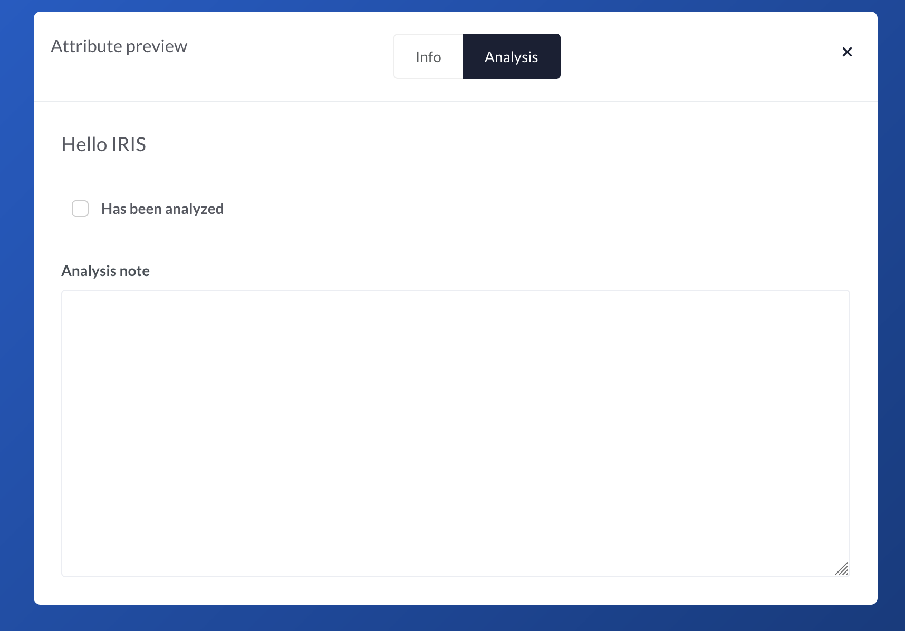
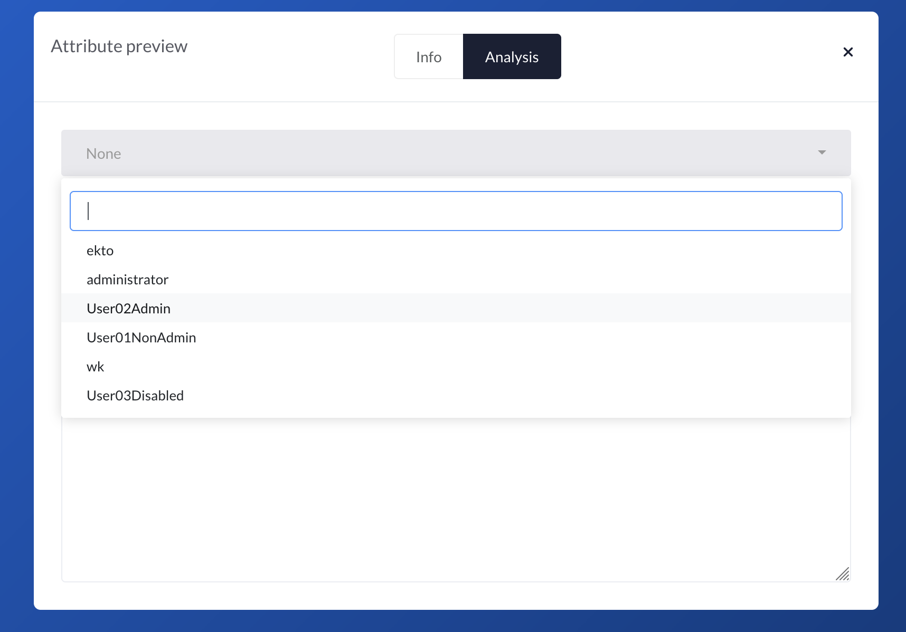
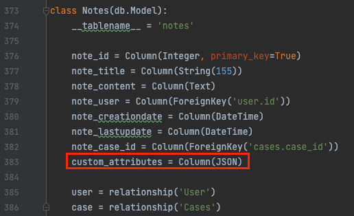

---
tags:
  - Tips
  - Custom Attributes
author: whitekernel
description: A deep dive into Custom Attributes, a way of extending natives fields in almost any case objects.
---


# A deep dive into Custom Attributes

In IRIS [v1.4.0](https://docs.dfir-iris.org/changelog/#v140-april-6-2022) we introduced the concept of Custom Attributes, a way to extend the default fields of any case objects. We already published [some documentation](https://docs.dfir-iris.org/operations/custom_attributes/) about it, but today we are exploring the full potential of custom attributes.

## A basic example  
Let's start with a simple example and extend the Evidences objects.  
We will : 

 - Add a new checkbox to allow analysts to indicate whether they analyzed the evidence or not, 
 - Add a text field to allow them write some notes about the analysis

Heading to the attributes administration page in `Advanced` > `Custom Attributes`, we open the custom attributes for Evidences. 


The window should looks like this unless you already added some custom attributes.  


The right text input allows us to describe the custom attributes thanks to a simple JSON formatting. They are defined as follow : 
```json  linenums="1"
{
    "New Tab Name": {                    
        "New Field Name" : {
            "type": "Field type",
            "mandatory": false,
            "value": "default value"
        }
    }
}
```

- Line 2 creates a new tab in the object
- Line 3 creates a new field within this new tab 
- Line 4 to 6 describes the type and default values of this new field. 

Field types are predefined types, described in [attributes taxonomy](https://docs.dfir-iris.org/operations/custom_attributes/#attributes-taxonomy).   
So let's translate this into our example. We want to create a new tab called "Analysis" in Evidences object, and within these two new fields : 

 - A checkbox "Has been analyzed"
 - A text field "Analysis notes"

Checkbox is of type `input_checkbox`, and the text field is of type `input_textfield`.   
Putting it all together : 
```json linenums="1" title="Basic attribute"
{
    "Analysis": {
        "Has been analyzed": {
            "type": "input_checkbox",
            "mandatory": false,
            "value": false
        },
        "Analysis note": {
            "type": "input_textfield",
            "mandatory": false,
            "value": ""
        }
    }
}
```

By setting `mandatory` to false, we ensure the creation/update of Evidences are not rejected if these fields are not set by the users.  
`value` must be set to a boolean for checkbox inputs. It can be set to nothing for the text field.   

Now it's time to ensure our attributes are rendered as expected. Let's click on `preview`, and then on the - hopefully - new tab `Analysis` on the preview.   


There we go ! 

We can now deploy our changes to the Evidence objects. Curious about how it's handled under the hood ? You can take a look a the deep dive section [Under the hood](#under-the-hood).   

We will deploy the changes to all Evidences objects but not force the overwrite if some of them already have attributes. We close the preview and we click on `Update`. Depending on how many Evidences you have, this can take a little time, but once the update is finished, all Evidences objects should have our new custom attributes.   
We head to the Evidence section of one of our case, click on one of them or try to add one, and we should have a beautiful new tab in our Evidence. 


Input a few notes, check the box and click on `Update`. The data is now saved with the object.  Time to celebrate ! :material-party-popper:

## Dynamic custom attributes 
That's great, but now what if we want to add the possibility to specify who analyzed the Evidence ? We could add a new text input, but let's make something a little more advanced by proposing a list of all the analysts on the platform.  

### Raw HTML fields
There is no direct way of proposing a list of analysts with standard custom attributes, however we have the powerful `html` type and thanks to that we can input HTML and so Javascript.  HTML custom attributes are not processed by IRIS and are rendered as-is in the objects. 

Let's take the previous Evidence custom attribute and add a new `html` entry to it, with a simple `h3` entity as HTML content. 
```json linenums="1" title="Dynamic attribute" hl_lines="2 3 4 5 6 7"
{
    "Analysis": {
        "Analyzed by JS": {
            "type": "html",
            "mandatory": false,
            "value": "<h3>Hello IRIS</h3>"
        },
        "Has been analyzed": {
            "type": "input_checkbox",
            "mandatory": false,
            "value": false
        },
        "Analysis note": {
            "type": "input_textfield",
            "mandatory": false,
            "value": ""
        }
    }
}
```
Which gives 


Nice, we can now add raw HTML to our custom attribute. IRIS uses [Bootstrap](https://bootstrap.com) to ease the UI/UX interface, so we can directly reuse these components. Let's replace the `h3` with a Bootstrap Select. 

!!! note
    Unfortunately JSON does not support multiline strings, so to ease the reading we provide a prettified version of the HTML separately, and next to it, the corresponding final Custom Attribute definition.  

=== "HTML template value field"

    ```html linenums="1" 
    <label>Analyzed by</label>
    <select class='selectpicker form-control'></select>
    ```

=== "Corresponding custom attribute definition"

    ```json linenums="1" 
    {
        "Analysis": {
            "Analyzed by JS": {
                "type": "html",
                "mandatory": false,
                "value": "<label>Analyzed by</label><select class='selectpicker form-control'></select>"
            },
            "Has been analyzed": {
                "type": "input_checkbox",
                "mandatory": false,
                "value": false
            },
            "Analysis note": {
                "type": "input_textfield",
                "mandatory": false,
                "value": ""
            }
        }
    }
    ```

If you preview this, you'll notice that you see nothing. That's because we need to add some JS to make the select load. First we give the select an ID (`evidence_analyst_analysis`) so we can reference it in the JS, and then call the SelectPicker JS loader on it.  

=== "HTML template value field" 

    ```html linenums="1" hl_lines="3 6 7 8 9 10 11 12"
    <label>Analyzed by</label>
    <select class='selectpicker form-control' 
            id='evidence_analyst_analysis'
    ></select>

    <script>
        $('#evidence_analyst_analysis').selectpicker({
            liveSearch: true,
            title: 'Analyst',
            style: "btn-outline-white"
        });
    </script>
    ```

=== "Corresponding custom attribute definition"

    ```json linenums="1" 
    {
        "Analysis": {
            "Analyzed by JS": {
                "type": "html",
                "mandatory": false,
                "value": "<label>Analyzed by</label><select class='selectpicker form-control' id='evidence_analyst_analysis'></select><script>$('#evidence_analyst_analysis').selectpicker({liveSearch: true,title: 'Analyst',style: 'btn-outline-white'});</script>"
            },
            "Has been analyzed": {
                "type": "input_checkbox",
                "mandatory": false,
                "value": false
            },
            "Analysis note": {
                "type": "input_textfield",
                "mandatory": false,
                "value": ""
            }
        }
    }
    ```

We can now preview it. 


Good, we're on the right way ! 

### Requesting external resources
We now need to fill the select picker with the available analysts names. Fortunately, we have an [API endpoint](https://docs.dfir-iris.org/_static/iris_api_reference_v1.0.3.html) for that and we can add some JS to request it and fill our `select`. There's a few JS glue already written within IRIS, so we're going to use that to ease the writing.  

=== "HTML template value field"

    ```html linenums="1" hl_lines="10 11 12 13 14 15 16"
    <label>Analyzed by</label>
    <select class='selectpicker form-control' id='evidence_analyst_analysis'></select>
    <script>
        $('#evidence_analyst_analysis').selectpicker({
            liveSearch: true,
            title: 'Analyst',
            style: 'btn-outline-white'
        });

        get_request_api('/manage/users/restricted/list')
        .done((response) => {
            for (index in response.data) {
                $('#evidence_analyst_analysis').append(`<option value='${response.data[index].user_id}'>${response.data[index].user_name}</option>`);
            }
            $('#evidence_analyst_analysis').selectpicker('refresh');
        });
    </script>
    ```

=== "Corresponding custom attribute definition"

    ```json linenums="1"
    {
        "Analysis": {
            "Analyzed by JS": {
                "type": "html",
                "mandatory": false,
                "value": "<label>Analyzed by</label><select class='selectpicker form-control' id='evidence_analyst_analysis'></select><script>$('#evidence_analyst_analysis').selectpicker({liveSearch: true,title: 'Analyst',style: 'btn-outline-white'});get_request_api('/manage/users/restricted/list').done((response) => {for (index in response.data) {$('#evidence_analyst_analysis').append(`<option value='${response.data[index].user_id}'>${response.data[index].user_name}</option>`);}$('#evidence_analyst_analysis').selectpicker('refresh');});</script>"
            },
            "Has been analyzed": {
                "type": "input_checkbox",
                "mandatory": false,
                "value": false
            },
            "Analysis note": {
                "type": "input_textfield",
                "mandatory": false,
                "value": ""
            }
        }
    }
    ```

Let's break it down a little.  

 - Line 2 declares the select picker for our analysts to choose a name from 
 - Lines 4 to 8 initiate the selectpicker lib on the select, so we have live search, bootstrap theme etc. 
 - Line 10 asynchronously requests the API endpoint to get a list of the users
 - Lines 11 to 15 is a promise that is called upon request completion, add the users options to the select and finally refresh the select with the newly added options.  

If we now look at this new code, we should see the list of analysts. 



We are getting close ! Now, if you deploy these changes and try to save the information of our tab, you'll see that it doesn't work and only the `Analysis note` and `Has been analyzed` fields are saved. The `Analyst` information is lost.   

That's because HTML custom attributes cannot be saved by users, otherwise this would open the platform to a multitude of vulnerabilities. Please see section [Values saving](#values-saving) for more information.  

What we can do instead, is add a new input field and use it as a saving mechanism. 

### Saving values with HTML fields
So let's add an `input_string` field named `User ID` in our custom attribute, just below the HTML one. This should look like this. 

```json linenums="1" title="Addition of an input string" hl_lines="8 9 10 11"
{
    "Analysis": {
        "Analyzed by JS": {
            "type": "html",
            "mandatory": false,
            "value": "<label>Analyzed by</label><select class='selectpicker form-control' id='evidence_analyst_analysis'></select><script>$('#evidence_analyst_analysis').selectpicker({liveSearch: true,title: 'Analyst',style: 'btn-outline-white'});get_request_api('/manage/users/restricted/list').done((response) => {for (index in response.data) {$('#evidence_analyst_analysis').append(`<option value='${response.data[index].user_id}'>${response.data[index].user_name}</option>`);}$('#evidence_analyst_analysis').selectpicker('refresh');});</script>"
        },
        "User ID": {
            "type": "input_string",
            "mandatory": false,
            "value": ""
        },
        "Has been analyzed": {
            "type": "input_checkbox",
            "mandatory": false,
            "value": false
        },
        "Analysis note": {
            "type": "input_textfield",
            "mandatory": false,
            "value": ""
        }
    }
}
```

Now, the idea is to detect a change in the dropdown, put the value in the new `input_string` field to save our data. And then upon load, check the value in the input field and select the corresponding value in the dropdown.  

**But how can we know the ID of the new input field we created ?**  
The generator actually uses a convention, and the field will always have the same name if it stays at the same position in the custom attribute. If you save the current attribute and check the ID of the field with the browser debugger, you will see `inpstd_2_user_id` (i.e *standard input* in position  *2* named *user id*).  

So we can now use this ID and build up our JS.  

=== "HTML template value field"

    ```html linenums="1" hl_lines="4 6 21 22 23 25 28 29 30"
    <label>Analyzed by</label>
    <select class='selectpicker form-control' id='select_evidence_analysis_analyst'></select>
    <script>
        $('#inpstd_2_user_id').attr('disabled', 'disabled'); // (1)

        cur_user = $('#inpstd_2_user_id').val();  // (2)
        
        $('#select_evidence_analysis_analyst').selectpicker({
            liveSearch: true,
            title: 'Analyst',
            style: 'btn-outline-white'
        });

        get_request_api('/manage/users/restricted/list')
        .done((response) => {

            for (index in response.data) {
                $('#select_evidence_analysis_analyst').append(`<option value='${response.data[index].user_id}'>${response.data[index].user_name}</option>`);
            }

            if (cur_user !== undefined) {
                $('#select_evidence_analysis_analyst').val(cur_user);  // (3)
            }

            $('#select_evidence_analysis_analyst').selectpicker('refresh');  // (4)
        });

        $('#select_evidence_analysis_analyst').on('changed.bs.select', function (e, clickedIndex, newValue, oldValue) {
            $('#inpstd_2_user_id').val($(e.currentTarget).val());   // (5)
        });     
    </script>
    ```
    
    1.  Disable the new input field so the users don't mess with it unintentionally 
    2.  Get the current value of the input in case the analyst is already set
    3.  If the analyst is already set, then set the analyst ID in our Select as default 
    4.  Refresh the Select so the new values are taken into account
    5.  Whenever the Select is changed, get the selected value and put it into the input field


=== "Corresponding custom attribute definition"

    ```json linenums="1" title="Final Custom attribute definition"
    {
        "Analysis": {
            "Analyzed by JS": {
                "type": "html",
                "mandatory": false,
                "value": "<label>Analyzed by</label><select class='selectpicker form-control' id='select_evidence_analysis_analyst'></select><script>    $('#inpstd_2_user_id').attr('disabled', 'disabled');    cur_user = $('#inpstd_2_user_id').val();        $('#select_evidence_analysis_analyst').selectpicker({        liveSearch: true,        title: 'Analyst',        style: 'btn-outline-white'    });    get_request_api('/manage/users/restricted/list')    .done((response) => {        for (index in response.data) {            $('#select_evidence_analysis_analyst').append(`<option value='${response.data[index].user_id}'>${response.data[index].user_name}</option>`);        }        if (cur_user !== undefined) {            $('#select_evidence_analysis_analyst').val(cur_user);        }        $('#select_evidence_analysis_analyst').selectpicker('refresh');    });    $('#select_evidence_analysis_analyst').on('changed.bs.select', function (e, clickedIndex, newValue, oldValue) {        $('#inpstd_2_user_id').val($(e.currentTarget).val());    });     </script>"
            },
            "User ID": {
                "type": "input_string",
                "mandatory": false,
                "value": ""
            },
            "Has been analyzed": {
                "type": "input_checkbox",
                "mandatory": false,
                "value": false
            },
            "Analysis note": {
                "type": "input_textfield",
                "mandatory": false,
                "value": ""
            }
        }
    }
    ```

We can now remove the new lines of this snippet to place it in the `value` field of our HTML attribute and obtain our final custom attribute. 

```json linenums="1" title="Final Custom attribute definition"
{
    "Analysis": {
        "Analyzed by JS": {
            "type": "html",
            "mandatory": false,
            "value": "<label>Analyzed by</label><select class='selectpicker form-control' id='select_evidence_analysis_analyst'></select><script>    $('#inpstd_2_user_id').attr('disabled', 'disabled');    cur_user = $('#inpstd_2_user_id').val();        $('#select_evidence_analysis_analyst').selectpicker({        liveSearch: true,        title: 'Analyst',        style: 'btn-outline-white'    });    get_request_api('/manage/users/restricted/list')    .done((response) => {        for (index in response.data) {            $('#select_evidence_analysis_analyst').append(`<option value='${response.data[index].user_id}'>${response.data[index].user_name}</option>`);        }        if (cur_user !== undefined) {            $('#select_evidence_analysis_analyst').val(cur_user);        }        $('#select_evidence_analysis_analyst').selectpicker('refresh');    });    $('#select_evidence_analysis_analyst').on('changed.bs.select', function (e, clickedIndex, newValue, oldValue) {        $('#inpstd_2_user_id').val($(e.currentTarget).val());    });     </script>"
        },
        "User ID": {
            "type": "input_string",
            "mandatory": false,
            "value": ""
        },
        "Has been analyzed": {
            "type": "input_checkbox",
            "mandatory": false,
            "value": false
        },
        "Analysis note": {
            "type": "input_textfield",
            "mandatory": false,
            "value": ""
        }
    }
}
```

We save and deploy the new custom attribute, and there we are - we can now select a user and save it !  


### A final note

We have to admit, **this was far from trivial** :material-emoticon-sick-outline:. We are currently thinking of new ways to improve these types of specific custom attributes, and they will probably get better over time. In the meantime, the solution is always a trick away ! 

## Under the hood
So how does custom attributes work under the hood ? It's actually simpler than writing one as we did above. :fontawesome-regular-face-smile-beam:   
Each case objects table in the DB holds a `custom_attributes` field, which is of type `JSON`.  For instance, below is the DB declaration of the Notes.  



When a custom attribute is created, let's say for Notes, IRIS loops over all existing Notes and apply the JSON structure you just wrote. All of the Notes are now holding this custom attribute.   

### Rendering
When the details for a Note object is requested by a user, either for creation or update, IRIS reads this custom attribute field and then starts to build a visual representation from the JSON. It does so by calling a Jinja templated HTML piece and then add this piece to the rest of the standard Note object. 
This Jinja template is in `source/app/templates/modals/modal_attributes_tabs.html`.  

Let's break it down and simplify it. 


```html linenums="1"
<!-- Verify if the object has custom attributes -->


    <!-- Loop over each CA and build the tab -->
    
        <div class="tab-pane" title="{{ ca }}">
            
        <!-- Loop over each field and build them -->
        

            <!-- Switch case according to the field type -->
            
                <input type="text" value="{{ attributes[ca][cle]["type"]['value'] }}"/>

            
                <input type="checkbox" value="<redacted for readability>"/>

            
                {{ attributes[ca][cle]["type"]['value'] }}
            
            <!-- etc.. -->

            

        

        </div>
    


```

The templates loops over all attributes in the custom attribute JSON definition, and depending on the `type` of field, write a corresponding HTML tag.   
You may notice that [line 18](#__codelineno-13-18), the `HTML` type directly writes the `value` on the template. That's what allows us to write raw HTML with Javascript !   


### Values saving

Now, when the data is saved in the object, the client sends a JSON containing the original objet fields, as well as the custom attributes information.   
With the example in [Basic Example](#__codelineno-1-1), let's take a look on what happens when the data is saved.  


Looking at the request emitted upon Update, we can see a POST towards `case/evidences/update/XX`. This is the update endpoint. The payload of the request contains the standard fields of the Evidences, as well as the custom attributes. 

```json title="Evidence update POST payload" linenums="1" hl_lines="7 8 9 10 11 12"
{
    "filename": "My evidence",
    "file_size": "15654",
    "file_hash": "XXX",
    "file_description": "",
    "csrf_token": "REDACTED",
    "custom_attributes": {
        "Analysis": {
            "Analysis note": "Hello world",
            "Has been analyzed": true
        }
    }
}
```

Lines [7](#__codelineno-14-7) to [12](#__codelineno-14-12) contains the new values of the custom attributes.  
When receiving the data, IRIS operates a merge.  

1. Loads the current custom attribute JSON of the Evidence
2. Loops over the received data in `custom_attributes`
3. Searches for a tab named `Analysis` in the loaded JSON
4. Within it searches for a field named `Analysis note`, and sets its `value` to `Hello world`
5. Within the same tab, searches for a field named `Has been analyzed` and sets its `value` to true.  
6. Saves the JSON back in the Evidence. The data is saved !

Now the custom attribute field of the Evidence looks like this : 

=== "Updated custom attribute"

    ```json hl_lines="6 11" linenums="1" 
    {
        "Analysis": {
            "Has been analyzed": {
                "type": "input_checkbox",
                "mandatory": false,
                "value": false
            },
            "Analysis note": {
                "type": "input_textfield",
                "mandatory": false,
                "value": "Hello world"
            }
        }

    }
    ```

=== "Original custom attribute"

    ```json linenums="1" 
    {
        "Analysis:" {
            "Has been analyzed": {
                "type": "input_checkbox",
                "mandatory": false,
                "value": false
            },
            "Analysis note": {
                "type": "input_textfield",
                "mandatory": false,
                "value": ""
            }
        }
    }
    ```

**Security note**  
Let's consider an `HTML` field such as follow : 

```json hl_lines="6 11" linenums="1" 
{
    "Analysis": {
        "Analysis header": {
            "type": "html",
            "mandatory": false,
            "value": "<h1>Analysis</h1>"
        }
    }
}
```
What if a user sends a request to update this field ? For instance : 

```json hl_lines="9" linenums="1" title="Malicious Evidence update POST payload"
{
    "filename": "My evidence",
    "file_size": "15654",
    "file_hash": "XXX",
    "file_description": "",
    "csrf_token": "REDACTED",
    "custom_attributes": {
        "Analysis": {
            "Analysis header": "<script>Bad thing</script>"
        }
    }
}
```

This would let the user rewrite the HTML attribute in the Evidence object. The next time another user requests this Evidence, IRIS would read the `value` of the attribute `Analysis header`, renders the malicious payload and presents it to this user.  
**To avoid this, `HTML` field types are read-only for users.** They can't update them.    

And we're done for this deep dive !  :fontawesome-regular-face-smile-beam:

That's a long one, but hopefully this brings some lights on how the custom attributes are working behind the scene.   
Don't hesitate to [contact us](https://docs.dfir-iris.org/contact/), should you have any questions or remarks.    

*[@whitekernel](https://twitter.com/white_kernel)*