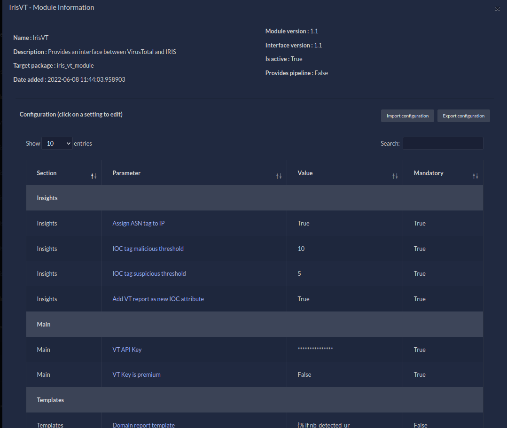

---
tags:
  - Walkthrough
  - Tips
  - Module
author: ekt0
description: A series of articles about DFIR-IRIS Modules, introducing the module generator iris-skeleton-module based on cookiecutter.
---

# DFIR-IRIS Modules walkthrough Part 1: A Skeleton Dance


> The topic of this article is to demonstrate how to get started with the development of a new module, and what structure to follow. To help this purpose, we developed a DFIR-IRIS Module generator called `iris-skeleton-module` that takes care of all the boilerplate code for either pipeline or processor modules.

## DFIR-IRIS Module (DIM) overview

Before jumping into the real purpose of this article, let's have an overview on DFIR-IRIS Modules. If you already feel familiar with this topic, you can skip this part and go to the next section.

IRIS can be extended with modules since its publication on GitHub end of 2021. We call them DFIR-IRIS Modules (DIMs). And no, they are not related to the underwear brand. As the documentation specifies:

> A DIM is a Python package allowing to extend IRIS features. DIMs are not running constantly and are only called following specific actions done by users.

### Pipeline module

Back then, we could already use **pipeline** modules in order to ingest files from IRIS and process them accordingly. For example, there is a DIM called `iris_evtx` that ingests EVTX files from IRIS. It converts them in JSON and pushes the result into Splunk.


**Figure 1 - iris-evtx DIM pipeline**

The text input boxes in figure 1 such as `index_evtx` are pipeline arguments directly passed to the module. More information later in the next section.

Once the EVTX are processed, the status of the task can be consulted in the "DIM tasks" tab:


**Figure 2 - iris-evtx DIM task sum up**


**Figure 3 - iris-evtx DIM task details**

### Processor module

IRIS v1.4.0 introduced a new type of module, the **processor** module. Processor modules can enrich any case object: Note, Ioc, Asset, Evidence, and even a Case. The most obvious use is the enrichment of the indicators of compromise (IOCs), because during investigations analysts need to qualify any suspicious element they encounter. For example, there is a module called `iris_vt_module` that enriches some types of IOCs (hashes, IP addresses, domains and URLs) with VirusTotal intelligence.


**Figure 4 - iris-vt-module manual hook**

Thanks to the custom attributes (more insights about this in this previous article [A deep dive into Custom Attributes](https://blog.dfir-iris.org/deep_dives/custom_attributes_dive/)), the targeted indicator of compromise gets a new tab called "VT Report", displaying the results of the enrichment with `iris-vt-module` in a nice way. The module can also directly interact with the attributes of the IOC object: to add a new tag saying it's malicious, a description, etc.


**Figure 5 - VirusTotal custom attribute on IOC object**

Processor modules tasks status can also be consulted in the **DIM tasks**.


**Figure 6 - iris-vt-module DIM task sum up**


**Figure 7 - iris-vt-module DIM task details**

The task can be triggered manually as shown in figure 4, or automatically. How does it work? IRIS implements a set of hooks triggered before or after an object (e.g. an IOC) is created or updated to the database. The `iris-vt-module` module uses these hooks to automatically enrich a new IOC. A hook triggered *before* the object is committed to the database has the `on_preload_something` prefix. And a hook triggered *after* the object is committed to the database has the `on_postload_something` prefix.
In this scenario, the module registers functions to two different hooks: `on_postload_ioc_create` and `on_postload_ioc_update`. If we take the first hook, it means that once an IOC is created in the database, the `on_postload_ioc_create` hook is triggered. The module then receives both the event and the newly created IOC, executes the task accordingly (e.g: query a domain on VirusTotal and parse the report), and finally adds new information to this IOC (as in figure 5).

As a final note on this overview, a module cannot be of two types at the moment. Either it's a pipeline module, or it's a processor module (it will matter for the next part). I did not write about how to import and configure a module. If you want more information about this, you can check the documentation: [module management](https://docs.dfir-iris.org/operations/modules/mod_management/).

## DIMs development

The documentation explains well the structure of DIMs and the interface, so I won't cover it too much. If you want to develop DIMs I heavily recommend to follow this overview and the tutorial: [modules development](https://docs.dfir-iris.org/development/modules/). This section only sums up the purpose of the interface, and adds some tips about DIM development based on my experience.

### The interface

Both types of DIMs follow the same internal structure. As said earlier, they are Python packages, and they both inherit from a common class named `IrisModuleInterface`. This interface is included in the Python library [iris-module-interface](https://github.com/dfir-iris/iris-module-interface). Thanks to this interface, the modules implement methods that IRIS recognises and uses to pass data to them and receive results back.

Let's see a description of important attributes and methods implemented by the interface:

- `_module_configuration` (attribute): A list of dictionaries containing the configuration of the module. It will be shown in the UI of the module management tab. For example, with `iris-vt-module` you can see below a part of its module_configuration, and how it is rendered in IRIS:

```python
module_configuration = [
    {
        "param_name": "vt_api_key",
        "param_human_name": "VT API Key",
        "param_description": "API key to use to communicate with VT",
        "default": None,
        "mandatory": True,
        "type": "sensitive_string"
    },
    {
        "param_name": "vt_key_is_premium",
        "param_human_name": "VT Key is premium",
        "param_description": "Set to True if the VT key is premium",
        "default": False,
        "mandatory": True,
        "type": "bool"
    },
    [...]
]
```

Code: [IrisVTConfig.py#L28](https://github.com/dfir-iris/iris-vt-module/blob/master/iris_vt_module/IrisVTConfig.py#L28)


**Figure 8 - iris-vt-module configuration management**

As you can see, the configuration can be edited directly from the UI.

- `_pipeline_info` (attribute): Only useful for pipeline modules. It is used to specify arguments expected by the pipeline DIM in addition to receiving files. For example, `iris-evtx` module needs a Splunk index to push parsed EVTX data to Splunk. If the index does not exist the module will create it, but it still needs a name. To solve that, it asks for a required argument `index_evtx`. An optional argument `hostname_evtx` is available if a user wants to force a value in the `host` field (on Splunk). You can see how it is rendered in figure 1.

```python
pipeline_info = {
    "pipeline_internal_name": "evtx_pipeline",
    "pipeline_human_name": "EVTX Pipeline",
    "pipeline_args": [
        ['index_evtx', 'required'],
        ['hostname_evtx', 'optional']
    ],
    "pipeline_update_support": True,
    "pipeline_import_support": True
}
```

Code: [IrisEVTXModConfig.py#L26](https://github.com/dfir-iris/iris-evtx-module/blob/master/iris_evtx/IrisEVTXModConfig.py#L26)

- `module_dict_conf` (property): use this property to get the module configuration as set by the users on the UI. The fields are specific to each module. For example, if the IRIS user passed an API key for Virustotal in the `iris-vt-module` DIM, it can be fetched inside the class using `self.module_dict_conf.get("vt_api_key")`. See the definition of the configuration fields in [IrisVTConfig.py](https://github.com/dfir-iris/iris-vt-module/blob/master/iris_vt_module/IrisVTConfig.py).
    
- `server_dict_conf` (property): use this property to get settings about the IRIS server. It is particularly useful when you need to fetch the proxy parameters that have been set. To get the value: `self.server_dict_conf.get('HTTPS_PROXY')` or `self.server_dict_conf.get('HTTP_PROXY')`
    
- `get_evidence_storage()`: use this method to get the evidence storage. The evidence storage contains the metadata of files ingested from modules, or directly input from the web UI (the *Evidences* tab) or the API. For example, the pipeline module can use the evidence storage to import the metadata of files successfully processed. That's the case for `iris-evtx-module`. In figure 1, a few EVTX files have been successfully imported. They are now *stored* (their metadata actually) in the evidence storage of the case.
    
    **Figure 9 - Evidences tab**
    
- `add_tab_attribute_field(obj, tab_name, field_name, field_type, field_value, mandatory=None, field_options=None)`: This method can be used to add a new field to an IRIS object, such as an IOC. That is how `iris-vt-module` adds a custom attribute in figure 5. More information on [vt_handler.py#L162](https://github.com/dfir-iris/iris-vt-module/blob/master/iris_vt_module/vt_handler/vt_handler.py#L162). `add_tab_attribute` is not part of the interface and must be imported from IRIS codebase using:
    

```
from app.datamgmt.manage.manage_attribute_db import add_tab_attribute_field
```

We plan to develop a "proxy" function in the module interface to avoid users importing code from IRIS platform. But at least with this example, you can see that it's possible!

- There are other few methods only meant to help IRIS (the platform) identifying the module: its type (`get_module_type`), its name (`get_module_name`), its description (`get_module_description`), etc. As I said, it is only useful for IRIS, you needn't use them in the module code.

As stated earlier, `IrisModuleInterface` is a Python interface. It provides method signatures that will be implemented by the inherited modules. Some methods signatures are only useful for pipeline modules, and some others for processor modules. Let's split them in different sections for clarity.

### Pipeline module methods

*When "not implemented" is specified below, it means that the method signature exists in the interface but its code must be implemented by the module if needed.*

- `pipeline_init(app_info)` (not implemented): For future uses. This function is called while IRIS initiates. It has to initiate the data needed by the pipeline such as initiating its database.
- `pipeline_files_upload(base_path, file_handle, case_customer, case_name, is_update)` (not implemented): This method is used by IRIS to notify the module that a user initiated a file upload with its pipeline. The module is responsible to saving the file. As illustrated in figures 1 and 9, the EVTX pushed by the user to the EVTX Pipeline are saved by this method. I suggest to use the `base_path` as the root directory destination for the input files (`file_handle`)
- `pipeline_handler(pipeline_type, pipeline_data)` (not implemented): this method is called by IRIS after calling `pipeline_files_upload`. It is meant to notify the module that there are files in the pipeline to process. `pipeline_data` is actually a dictionary containing different files related to the task:
    - `pipeline_args`: a list of dictionaries containing pipeline arguments
    - `user` and `user_id`: the user who requested the task
    - `case_name` and `case_id`: the case linked to the task
    - `path`: the base path containing the files saved in `pipeline_files_upload`.
    - `is_update`: (deprecated) a boolean to know whether the case is being created or updated.

### Processor module methods

- `register_hooks(module_id)` (not implemented): This method is called by IRIS upon module registration. This method should call the method `register_to_hook` for each hook the module wishes to register. The module ID provided by IRIS in this method needs to be provided in every call to `register_to_hook`.
- `register_to_hook(module_id, iris_hook_name, manual_hook_name, run_asynchronously)`: The purpose of this method is then to register to an IRIS hook. The module ID (given by `register_hooks`) and `iris_hook_name` must be set. If `is_manual_hook` is set in the module configuration, a `manual_hook_name` can also be set (it will be displayed in the UI) otherwise a name will be automatically built by IRIS from the module and hook name. Finally, if `run_asynchronously` is set (default), the action will be sent to RabbitMQ and processed asynchronously. Otherwise, the action is immediately handled, which means it needs to be quick otherwise the request will be pending and user experience degraded. Moreover, `on_preload` hooks (as described in the first section) are synchronous anyway because the object is not yet saved in the database. So the `run_asynchronously` will be ignored in that case. As an example, here is how the VT DIM registers to the `on_postload_create` hook: `self.register_to_hook(module_id, iris_hook_name='on_postload_ioc_create')`. And for a manual hook: `self.register_to_hook(module_id, iris_hook_name='on_manual_trigger_ioc', manual_hook_name='Get VT insight')`.
- `deregister_from_hook(module_id, iris_hook_name)`: Unregister from an existing hook. The hook_name should be a well-known hook to IRIS. No error are thrown if the hook wasn't register in the first place. For example, the `iris-vt-module` unregisters to the `on_postload_create` hook like this: `self.deregister_from_hook(module_id=self.module_id, iris_hook_name='on_postload_ioc_create')`.
- `hooks_handler(hook_name, hook_ui_name, data)` (not implemented): This is the actual method that receives the events triggered by the IRIS hooks the module previously registered to, thanks to `register_hooks` method. It receives also an argument called `data`. For clarity, `data` is a list of IRIS objects related to the event. It will allow the module to manipulate the objects and add new information. The purpose of `hooks_handler` is simply to dispatch the received event to a routine.  For example, the VT DIM dispatches the events `on_postload_ioc_create` and `on_postload_ioc_update` to the same custom method `_handle_ioc`. Below you can see a snippet of code borrowed from `_handle_ioc`. It shows how the `data` argument is handled. The behaviour of this function depends on the type of IOC (domain, ip, hash...) it received.
```python
for element in data:
    # Check that the IOC we receive is of type the module can handle and dispatch
    if 'ip-' in element.ioc_type.type_name:
        status = vt_handler.handle_vt_ip(ioc=element)
        in_status = InterfaceStatus.merge_status(in_status, status)

    elif 'domain' in element.ioc_type.type_name:
        status = vt_handler.handle_vt_domain(ioc=element)
        in_status = InterfaceStatus.merge_status(in_status, status)

    elif element.ioc_type.type_name in ['md5', 'sha224', 'sha256', 'sha512']:
        status = vt_handler.handle_vt_hash(ioc=element)
        in_status = InterfaceStatus.merge_status(in_status, status)
    else:
        self.log.error(f'IOC type {element.ioc_type.type_name} not handled by VT module. Skipping')
```
Code: [IrisVTInterface#L127](https://github.com/dfir-iris/iris-vt-module/blob/master/iris_vt_module/IrisVTInterface.py#L127)

To conclude this section, we have seen what parts the module interface provides. Processor and pipeline module share the same codebase, but they use different methods. One must handle files (pipeline), and the other must handle IRIS objects from events based on hooks.

## Iris-skeleton-module: The DIM generator

Despite the module interface, there is still a lot of boilerplate code to take into account when developing a new module. Boilerplate code are sections of code that are repeated in multiple modules - in this case - with little to no variation. For example `iris-vt-module` and `iris-misp-module`, both processor DIMs, share approximately 50% of the same code.

In consequence, we developed (and published!) a DIM generator :tada: : [iris-skeleton-module](https://github.com/dfir-iris/iris-skeleton-module). Iris-Skeleton is a module generator based on [cookiecutter](https://github.com/cookiecutter/cookiecutter) and inspired by [python-package-template](https://github.com/TezRomacH/python-package-template). It is very simple to use, and it generates a new repository based on a template.

To get started, `cookiecutter` package must be installed: `pip install -U cookiecutter`. Then go to a directory where you want to create your DIM and run:

```
cookiecutter gh:dfir-iris/iris-skeleton-module
```

In order to generate the project, cookiecutter will ask for various [input variables](https://github.com/dfir-iris/iris-skeleton-module#input-variables). To sum up, it asks for a new module name, a keyword (e.g. for `iris-vt-module`, the keyword is VT, for `iris-evtx`, the keyword is EVTX), and a module description. It also asks for general information (email, license...) in order to generate the LICENSE.txt file, code headers, and the `setup.py` file. A Makefile is also generated. Finally, cookiecutter asks whether a pipeline or a processor module must be generated (remember that we can't have both at the same time :slight_smile:).

Once generated, the project will contain various files:

- the LICENSE.txt file
- the README file (very basic)
- the `setup.py file` filled with provided information
- the Makefile, to build, install, or clean the project with ease
- and last but not least, the module code itself. All the boilerplate code for the chosen type of module is already there, and even some pieces of example code and module configuration.

Let's create together the `iris-toto-module` pipeline DIM, in order to show you the process.

```bash
$ pip install -U cookiecutter # Install cookiecutter into your Py env
# Here you can customise your new module. Default values are between [].
module_name [iris-toto-module]: iris-toto-module
keyword [toto]: TOTO
module_description [`iris-toto-module` is a IRIS pipeline/processor module created with https://github.com/dfir-iris/iris-skeleton-module]: 
organization [iris-toto-module]: TotoCorp
Select license:
1 - MIT
2 - BSD-3
3 - GNU GPL v3.0
4 - Lesser GNU GPL v3.0
5 - Apache Software License 3.0
Choose from 1, 2, 3, 4, 5 [1]: 4
github_name [totocorp]: 
email [hello@totocorp.com]: demo@totocorp.org
version [0.1.0]: 
Select support:
1 - pipeline
2 - processor
Choose from 1, 2 [1]: 

Your module iris-toto-module is created.
1) Now you can start working on it:
    $ cd iris-toto-module && git init
2) If you dont have pip install it
3) Run the make command to use pip to build the wheel package or install in your environment
    $ make wheel
    $ make install
4) Upload initial code to GitHub:
    $ git add .
    $ git commit -m ":tada: Initial commit"
    $ git branch -M main
    $ git remote add origin https://github.com/totocorp/iris-toto-module.git
    $ git push -u origin main
5) grep -r "TODO" # to check what parts you should code
For more information on how to develop IRIS modules, please consider reading the documentation: https://docs.dfir-iris.org/development/modules/.
Good luck!

$ cd iris-toto-module
iris-toto-module $ ls
AUTHORS.txt  iris_toto_module  LICENSE  Makefile  README.md  setup.py
iris-toto-module $ cd iris_toto_module
iris-toto-module/iris_toto_module $ ls
__init__.py  IrisTotoConfig.py  IrisTotoInterface.py  toto_handler
iris-toto-module/iris_toto_module $ cd toto_handler
iris-toto-module/iris_toto_module/toto_handler $ ls
__init__.py  toto_handler.py
iris-toto-module/iris_toto_module/toto_handler $ cd ../..
iris-toto-module $ make wheel
pip wheel .
Processing iris-toto-module
  Preparing metadata (setup.py) ... done
Building wheels for collected packages: iris-toto-module
  Building wheel for iris-toto-module (setup.py) ... done
  Created wheel for iris-toto-module: filename=iris_toto_module-0.1.0-py3-none-any.whl size=9302 sha256=5af16b1bad27b9a8f0c82c223e0939c2c57de44b24e367a65f3d38babbc1b90b
  Stored in directory: /home/toto/.cache/pip/wheels/7b/40/f9/adce2221081fd31117daadee7d34715b7ff076412f592e45a0
Successfully built iris-toto-module
```

And that's all for the module generation! Now you can follow the instructions and consult the different source code files to get familiar with it. You can also generate a processor module in parallel to see the difference.

Thanks to `iris-skeleton-module`, it is now very accessible to develop new modules. The generated modules can even be installed as is. Of course, they don't *do* anything special, they just print some string in the task status when used. But it shows that they already have all the necessary code to handle inputs from IRIS, and send back the results.

Feel free to use it and tailor the template to your needs (and send PR :grin:). We plan to add more input variables to cookiecutter in order to generate even more repetitive code, such as module configuration or pipeline argument dictionaries. If you develop new modules and want to share it with the community, we would be glad to add it to our organization or put a reference to your repository!

The second part of this walkthrough will show the complete development of a pipeline - or maybe processor too :wink: - module using `iris-skeleton-module`. At the end, it will be published in the [dfir-iris organization](https://github.com/dfir-iris).

If you want to get updates from our blog, the best way is to follow us on [Twitter](https://twitter.com/dfir_iris) or join or [Discord](https://discord.com/invite/76tM6QUJza) :thumbsup:. If you have comments or questions you can reach us on Twitter, Discord, Matrix.org, and at the email address contact@dfir-iris.org.
